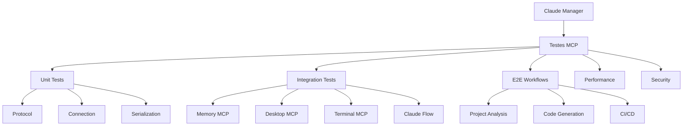

# 📊 Resumo Visual - Plano de Testes MCP

## 🎯 Visão Geral do Projeto



## 📅 Timeline de Implementação

```
Semana 1: FUNDAÇÃO 🏗️
├── Dia 1-2: Setup & Estrutura
├── Dia 3-4: Mocks & Protocolo
└── Dia 5: CI/CD & Docs

Semana 2: INTEGRAÇÃO ⚙️
├── Dia 1-2: Memory MCP
├── Dia 3-4: Desktop Commander
└── Dia 5: Terminal MCP

Semana 3: WORKFLOWS 🔄
├── Dia 1-2: Análise de Projeto
├── Dia 3-4: Geração de Código
└── Dia 5: Automação CI/CD

Semana 4: PRODUÇÃO 🚀
├── Dia 1-2: Performance
├── Dia 3-4: Segurança
└── Dia 5: Documentação Final
```

## 📊 Métricas de Sucesso

| Métrica | Target | Visual |
|---------|--------|--------|
| Cobertura | >85% | ████████░░ |
| Latência | <100ms | ████████░░ |
| Uptime | 99.9% | █████████░ |
| Docs | 100% | ██████████ |

## 🔧 Stack Tecnológico

### Core
- **pytest-asyncio**: Testes assíncronos
- **pytest-mock**: Mocking avançado
- **Docker**: Ambientes isolados

### MCPs Testados
1. **Memory MCP** 🧠
   - Entidades & Relações
   - Busca & Grafo
   - Persistência

2. **Desktop Commander** 💻
   - Operações de arquivo
   - Permissões
   - Monitoramento

3. **Terminal MCP** 🖥️
   - Execução segura
   - Captura de output
   - Timeouts

4. **Claude Flow** 🌊
   - Orquestração
   - Paralelização
   - Coordenação

## 🎯 Entregáveis por Fase

### ✅ Fase 1: Fundação
- [ ] Estrutura de diretórios
- [ ] Mock servers base
- [ ] Testes de protocolo
- [ ] CI/CD configurado

### 🔄 Fase 2: Integração
- [ ] 3 MCPs core testados
- [ ] 80% cobertura
- [ ] Error handling

### 🚀 Fase 3: Workflows
- [ ] 3 workflows E2E
- [ ] Testes paralelos
- [ ] Coordenação multi-MCP

### 🏁 Fase 4: Produção
- [ ] <100ms latência
- [ ] Security hardening
- [ ] Documentação completa

## 💡 Quick Start em 3 Passos

```bash
# 1. Criar estrutura
cd claude_manager/tests
mkdir -p mcp/{mocks,unit,integration}

# 2. Instalar dependências
uv sync --extra mcp

# 3. Rodar primeiro teste
uv run pytest tests/mcp -v
```

## 📈 Progresso Atual

```
[✅✅⬜⬜⬜⬜⬜⬜⬜⬜] 20% - Planejamento Completo
[⬜⬜⬜⬜⬜⬜⬜⬜⬜⬜] 0% - Implementação
[⬜⬜⬜⬜⬜⬜⬜⬜⬜⬜] 0% - Testes Rodando
[⬜⬜⬜⬜⬜⬜⬜⬜⬜⬜] 0% - Documentação
```

## 🔗 Links Importantes

- 📄 [Plano Detalhado](./mcp-test-implementation-plan.md)
- 🚀 [Guia Rápido](./mcp-quick-start-guide.md)
- 🏗️ [Arquitetura Claude Manager](./architecture.md)
- 📖 [MCP Protocol Docs](https://github.com/anthropics/mcp)

---

**Status**: 🟢 Pronto para Implementação
**Próximo Marco**: Setup Inicial (2 dias)